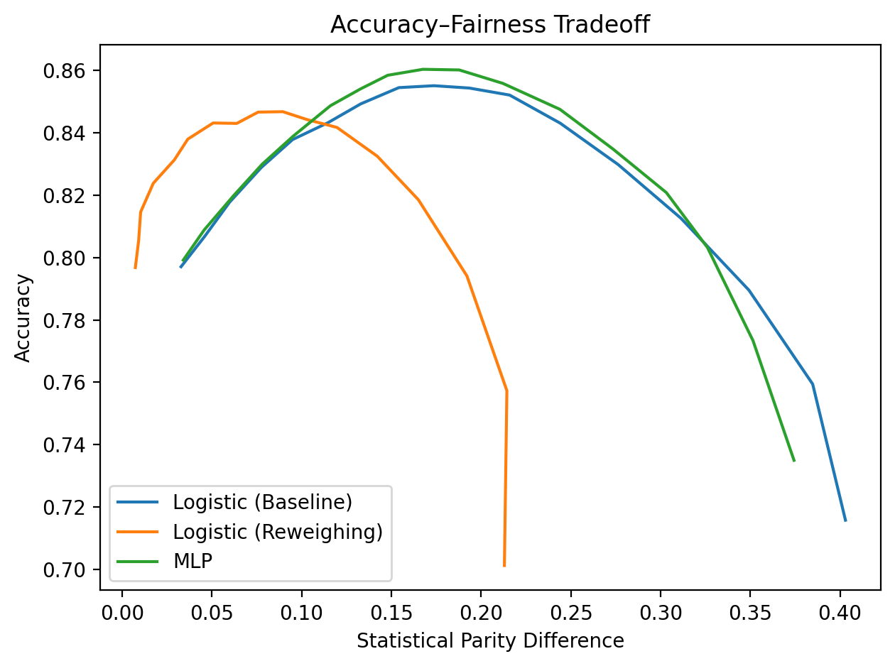

# Fairness–Performance Tradeoff on Adult Dataset (Logistic vs MLP)

This project implements a reproducible ML pipeline on the Adult (Census Income) dataset to study the fairness–performance tradeoff across model capacities, and explores fairness–performance tradeoffs in machine learning models.

## What’s inside
- Models:
  - Logistic Regression (scikit-learn)
  - MLP (PyTorch, 2 hidden layers)
- Fairness metrics (sex as sensitive attribute):
  - Statistical Parity Difference (SPD)
  - Equal Opportunity Difference (EOD)
  - Disparate Impact (DI)
- Mitigation:
  - Global threshold sweep to visualize accuracy–fairness tradeoff
  - Group-specific threshold calibration (male/female) via grid search

## Results (example)
- Both models achieve strong predictive performance (AUC > 0.90).
- Under a standard 0.5 threshold, both models show demographic disparity (SPD > 0.15, DI ~ 0.3).
- Group-specific threshold calibration can reduce SPD to ~0 with limited accuracy degradation.

## How to run
```bash
pip install -r requirements.txt
python src/fairness_adult.py

